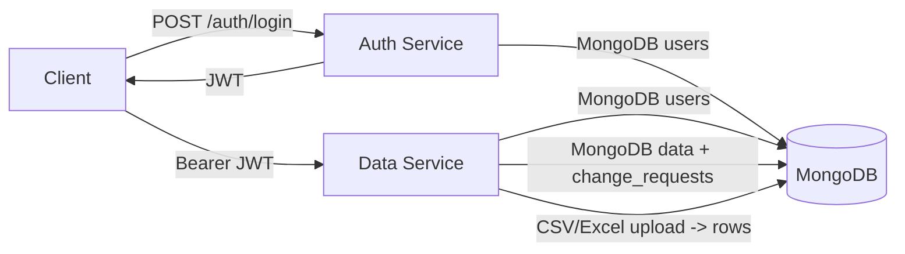

# RBAC System (Auth + Data Services)

Beginner friendly overview:
- Two services: Auth (login and users) and Data (data actions).
- Login returns a JWT token. Send this token with every data request.
- The Data service checks your role and allows or blocks actions.
- All users and data are stored in MongoDB.

---

## Quick start (minimal steps)

1) Install dependencies
```bash
pip install -r requirements.txt
```

2) Create `.env` in the repo root and set required values
- `SECRET_KEY`
- `MONGODB_URL`
- `MONGODB_AUTH_DB_NAME`
- `MONGODB_DATA_DB_NAME`
Optional: `AUTH_SERVICE_PORT`, `DATA_SERVICE_PORT`, `ALGORITHM`, `ACCESS_TOKEN_EXPIRE_MINUTES`

3) Start MongoDB (must match `MONGODB_URL`)

4) Seed default users
```bash
python init_db.py
```

5) Run services
```bash
# Terminal 1
python run_auth.py

# Terminal 2
python run_data.py
```

6) Open Swagger UI
- Auth: http://localhost:<AUTH_SERVICE_PORT>/docs
- Data: http://localhost:<DATA_SERVICE_PORT>/docs

---

## How requests work (simple flow)

1) Call `POST /auth/login` with a username and password.
2) Copy the `access_token` from the response.
3) Send that token as a header to Data Service:
   `Authorization: Bearer <JWT>`
4) Your role decides what you are allowed to do.

---

## Architecture and connections



Key connections:
- Auth and Data services both read `.env` and share `SECRET_KEY` and `ALGORITHM`.
- Data Service does not call Auth Service. It decodes JWTs locally and checks the user in the auth database.
- MongoDB has two databases: auth DB (`users`) and data DB (`change_requests` + category collections).

---

## Full setup details

### Environment variables
Required:
- `SECRET_KEY`
- `MONGODB_URL`
- `MONGODB_AUTH_DB_NAME`
- `MONGODB_DATA_DB_NAME`

Optional (defaults are used if missing):
- `ALGORITHM` (default: `HS256`)
- `ACCESS_TOKEN_EXPIRE_MINUTES` (default: `480`)
- `AUTH_SERVICE_PORT` (default: `8001`)
- `DATA_SERVICE_PORT` (default: `8000`)

---

## Default credentials

Seeded by [init_db.py](init_db.py):

| Role | Username | Password |
|------|----------|----------|
| manager | manager_admin | Manager@2024 |
| hr | hr_admin | HRAdmin@2024 |
| salesperson | sales_john | Sales@2024 |

---

## Roles and permissions

| Action | manager | salesperson | hr |
|--------|:-------:|:-----------:|:--:|
| Login | yes | yes | yes |
| Read/search/download data | yes | yes | yes |
| Upload CSV/Excel | yes | yes | no |
| Update/delete rows directly | yes | no | no |
| Submit change request | no | yes | no |
| Approve/reject change requests | yes | no | no |
| Create/update/activate users | no | no | yes |
| List/view users | yes | no | yes |

---

## API reference

### Auth Service

| Method | Path | Description |
|--------|------|-------------|
| POST | /auth/login | Login and get JWT |
| GET | /auth/verify?token=<JWT> | Verify JWT |
| GET | /auth/me?token=<JWT> | Current user info |
| GET | /health | Liveness probe |

Login body example:
```json
{ "username": "manager_admin", "password": "Manager@2024" }
```

### Data Service
All endpoints require `Authorization: Bearer <JWT>`.

| Method | Path | Roles | Description |
|--------|------|-------|-------------|
| GET | /data/categories | all | Predefined + existing categories |
| GET | /data/ | all | All categories with document counts |
| POST | /data/upload | manager, salesperson | Upload CSV/Excel to MongoDB |
| POST | /data/change-request | salesperson | Request update/delete |
| GET | /data/change-requests/my | salesperson | View own requests |
| GET | /data/change-requests/all | manager | View all requests |
| POST | /data/change-requests/{id}/resolve | manager | Approve/reject |
| GET | /data/{category}/search | manager, salesperson, hr | Search by field or all text fields |
| GET | /data/{category}/download | manager, salesperson, hr | Download full category as CSV |
| GET | /data/{category}/fields | all | List fields/columns |
| PUT | /data/{category}/{doc_id} | manager | Update a document |
| DELETE | /data/{category}/{doc_id} | manager | Delete a document |
| DELETE | /data/{category} | manager | Delete entire category |

Upload form fields:
- `file`: CSV or Excel
- `category`: predefined name or `others`
- `custom_category`: required when `category=others`

---

## Categories

Predefined: `salon`, `supermarket`, `restaurant`, `pharmacy`, `electronics`

When uploading:
- Use `category=others` and `custom_category=<name>` to create a new category.
- Rows get metadata columns: `added_by`, `added_by_role`, `uploaded_at`.

---

## File-by-file map (with connections)

- [init_db.py](init_db.py): Seeds default users into auth DB using [auth_service/database.py](auth_service/database.py) and password hashing from [auth_service/dependencies.py](auth_service/dependencies.py).
- [run_auth.py](run_auth.py): Runs Auth Service via uvicorn on `AUTH_SERVICE_PORT` from [auth_service/config.py](auth_service/config.py).
- [run_data.py](run_data.py): Runs Data Service via uvicorn on `DATA_SERVICE_PORT` from [data_service/config.py](data_service/config.py).
- [requirements.txt](requirements.txt): Python dependencies (FastAPI, MongoDB, JWT, pandas, Excel support).
- [auth_service/__init__.py](auth_service/__init__.py): Package marker for auth service.
- [auth_service/config.py](auth_service/config.py): Loads `.env`, defines auth DB and JWT settings, valid roles.
- [auth_service/database.py](auth_service/database.py): MongoDB client for auth DB and user indexes.
- [auth_service/dependencies.py](auth_service/dependencies.py): Password hashing, JWT create/verify, `get_current_user`, `require_roles` for auth service.
- [auth_service/schemas.py](auth_service/schemas.py): Pydantic models for login/verify/user info responses.
- [auth_service/main.py](auth_service/main.py): FastAPI app, CORS, routers, health endpoint.
- [auth_service/routers/auth.py](auth_service/routers/auth.py): `/auth/*` endpoints and JWT creation.
- [auth_service/routers/users.py](auth_service/routers/users.py): `/users/*` endpoints; uses `require_roles` and writes to MongoDB.
- [data_service/__init__.py](data_service/__init__.py): Package marker for data service.
- [data_service/config.py](data_service/config.py): Loads `.env`, data DB settings, predefined categories.
- [data_service/database.py](data_service/database.py): MongoDB client for both auth DB (users) and data DB (change requests + categories).
- [data_service/dependencies.py](data_service/dependencies.py): Decodes JWT and loads active user from auth DB.
- [data_service/main.py](data_service/main.py): FastAPI app, CORS, data router, health endpoint.
- [data_service/routers/data.py](data_service/routers/data.py): `/data/*` endpoints for upload/search/download, change requests, and CRUD.
- [data_service/utils/file_handler.py](data_service/utils/file_handler.py): MongoDB-backed CSV/Excel processing, search, update, delete, and category helpers.
- [data/salon.csv](data/salon.csv): Sample CSV for testing uploads.
